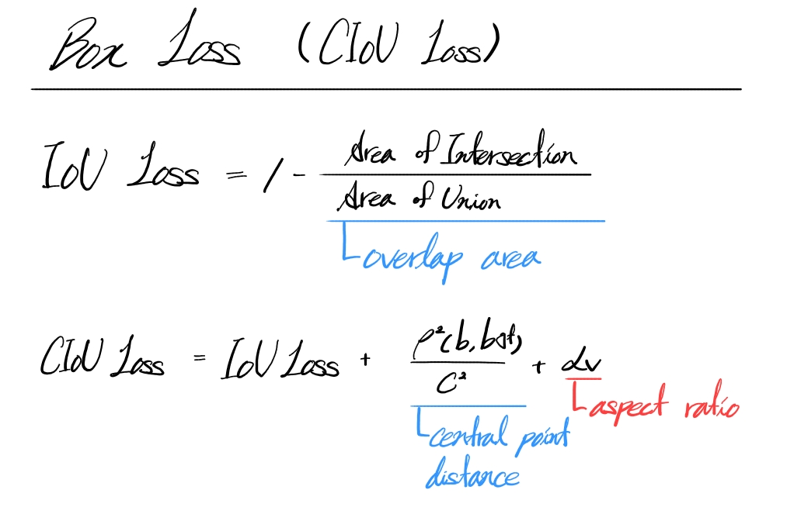

# Object Detection

COCO 데이터셋을 활용하여 Feature Pyramid Network (FPN) 기반의 사람 탐지 모델을 설계하고 학습한 프로젝트입니다.

*COCO Dataset에 Boundary Box를 적용한 이미지*

# Context
- [Overview](#overview)
  - [References](#references)
  - [Environment](#environment)
- [EDA (Exploratory Data Analysis)](#eda)
  - [Image Size Distribution](#image-size-distribution)
  - [Bounding Box Area Distribution](#bounding-box-area-distribution)
  - [Number of Objects per Image](#number-of-objects-per-image)
- [Model Design](#model-design)
  - [Architecture](#architecture)
- [Loss](#loss)
  - [Confidence Loss](#confidence-loss)
  - [Bounding Box Loss](#bounding-box-loss)
- [Training](#training)
  - [Hyperparameters](#hyperparameters)
  - [Result](#result)
- [Inference](#inference)

# Overview
 COCO 데이터셋을 분석하여 데이터의 특성을 파악하고, 그 결과를 바탕으로 ResNet-18 기반의 FPN 모델을 설계  합니다. Focal Loss와 CIoU Loss를 사용하여 학습 안정성과 성능을 향상시킵니다.

이 프로젝트의 두 가지 서브 목표가 있습니다.

1. 데이터 분석

Matplotlib을 사용하여 EDA를 수행하고, 분석을 기반으로 전체 훈련 과정을 설계합니다.

2. 신경망 설계

EDA를 통해 얻은 Prior-Knowledge를 신경망에 반영하는 방법을 익힙니다. 타 모델들의 구조를 분석하고, 그것을 바탕으로 커스텀 모델을 설계합니다.

### References

이 프로젝트는  아래의 논문들을 참고했습니다. 

1. He, K., Zhang, X., Ren, S., & Sun, J. ( 2016) Deep Residual Learning for Image Recognition. Proceedings of the IEEE Conference on Computer Vision and Pattern Recognition (CVPR), pp. 770-778. 
2. Lin, T., Dollar, P., Girshick, R., He, K., Hariharan, B., & Belongie, S. (2017) Feature Pyramid Networks for Object Detection. Proceedings of the IEEE Conference on Computer Vision and Pattern Recognition (CVPR), pp. 2117-2125.
3. Lin, T., Goyal, P., Girshick, R., He, K., & Dollar, P. (2017) Focal Loss for Dense Object Detection. Proceedings of the IEEE International Conference on Computer Vision (ICCV) , pp. 2980-2988.
4. Zheng, Z., Wang, P., Liu, W., Li, J., Ye, R., & Ren, D. (2020). Distance-IoU Loss: Faster and Better Learning for Bounding Box Regression. Proceedings of the AAAI Conference on Artificial Intelligence, 34(07), pp. 12993–13000.

### Environment
|  |  |
| --- | --- |
| OS | Ubuntu 22.04.3 LTS |
| GPU | NVIDIA RTX A5000 |
| 주요 라이브러리 | PyTorch, Torchvision, Matplotlib, OpenCV, NumPy |

# EDA
|  |  |
| --- | --- |
| Task | Object Detection |
| Data | COCO |
| Train | 118287 |
| Val | 5000 |
| BBox형식 |  [xmin, ymin, width, height] |

  

    
### Image Size Distribution

- The distribution shows that most images have a width between 500-650 pixels and a height between 500-680 pixels.

### Analyze

- Based on this, the model's input size is set to a fixed 640x640.

### Bounding Box Area Distribution

- Most bounding boxes have an area of 5,000 or less (small objects).
- Boxes with an area greater than 20,000 are very rare.
- A few very large boxes exist but are statistically negligible.

### Analyze

- The 'person' objects are mostly small, likely due to being captured from a distance.
- For datasets with many small objects, high-resolution input is important.
- Additionally, small bounding boxes are prone to being ignored or having their gradients vanish during training.

### Number of Objects per Image

- Most images contain only 1-3 objects, with a significant majority having just one.
- The count gradually decreases, but a small number of images contain 10 or more objects.
- A few images contain up to 14 objects.

### Analyze

- The model does not need to predict a large number of boxes per image.
- A complex anchor-based structure is likely unnecessary.

# Model Design
|  |  |
| --- | --- |
| Input | 640 x 640 |
| Output | conf, cx, cy, nw, nh |

|  |  |
| --- | --- |
| Conf | Probability of an object's presence |
| cx | Normalized x-coordinate of the BBox center |
| cy | Normalized y-coordinate of the BBox center |
| nw | Normalized width of the BBox |
| nh | Normalized height of the BBox |

### Architecture

*Diagram of FPN applied to ResNet-18*

FPN (Feature Pyramid Network) with a ResNet-18 Backbone.

1. Bottom-up Pathway
    
    This is the forward pass through the ResNet-18 backbone. In this process, the spatial resolution of the feature maps is progressively halved, while the number of channels doubles, creating a hierarchical structure. FPN utilizes the final output feature maps from each downsampling stage (C2, C3, C4, C5). Deeper layers are rich in semantic information, while shallower layers retain more spatial information.
    
2. Top-down Pathway & Lateral Connections
    
    This pathway transmits high-level semantic information from the top feature map (C5) down to the lower feature maps.
    
    - A 1x1 convolution is applied to the output of each stage (C2-C5) to unify the channel dimension to 64.
    - The feature map from the upper level is upsampled by a factor of 2 to match the spatial resolution of the next level down.
    - The upsampled map is then combined with the corresponding map from the bottom-up pathway (after its 1x1 convolution) via element-wise addition.
3. Final Feature Map Generation
    
    A 3x3 convolution is applied to each merged feature map. This helps to  reduce the aliasing effects that can occur during upsampling.
    

# Loss

The total loss is a weighted sum of the confidence loss and the bounding box regression loss.

$$
J(w) = \mathbb{E}_{x,y \sim \hat{p}_{\text{data}}}[\lambda_c \cdot FL(x,y) + \lambda_B \cdot \text{CloU Loss}]
$$

### **Confidence Loss**

Focal Loss modulates the standard Cross-Entropy Loss by multiplying it with a dynamic weighting factor. 

A higher gamma value reduces the loss contribution from easy examples, forcing the model to focus on hard examples.

### **Bounding Box Loss**

IoU (Intersection over Union) is the ratio of the overlapping area to the union area of two bounding boxes.

$$
\text{IoU} = \frac{\text{Area}(A \cap B)}{\text{Area}(A \cup B)}
$$

CIoU Loss enhances the IoU loss by incorporating the central point distance and the aspect ratio of the bounding boxes.

# Training

Initially, the parameters of the ResNet backbone were frozen, and only the FPN head was trained.

The reasons for freezing the parameters were as follows:

- The pre-trained ResNet already demonstrates sufficient performance in recognizing general image features.
- To reduce the overall training time.

### Hyperparameters
|  |  |
| --- | --- |
| Batch Size | 128 |
| Learning Rate | 0.0003 |
| Optimizer | AdamW |
| Epochs | 100 |

### Result

*Loss graph over epochs. Backbone weights were frozen.*

After a certain epoch, both the Train Loss and Test Loss stopped decreasing. 
This issue was not resolved even after replacing ResNet-18 with ResNet-50.

Therefore, the training was conducted again after unfreezing the weights of the ResNet-18 backbone (fine-tuning). The hyperparameters remained the same as in the previous experiment.

*Loss graph over epochs. Backbone weights were fine-tuned.*

- Change in Training Speed
    
    Upon unfreezing the backbone weights, the training time increased slightly but not significantly. This is because the ResNet-18 model is small enough that training its weights requires relatively few computations.
    
- Change in Loss
    
    The Train Loss continuously decreased over 100 epochs. Compared to the previous loss graph, this indicates that the ResNet-18 weights are now being effectively trained and contributing to the learning process.
    
    After epoch 30, the gap between the Train Loss and Test Loss gradually widened. The increase in Test Loss around epoch 73 indicates that the model is beginning to overfit to the training dataset.
    

# Inference

Inference is performed using the weights from epoch 73, where the model showed the best performance on the validation set before overfitting.

- Only inferences with a confidence score of 0.76 or higher are considered.
- For overlapping bounding boxes, Non-Maximum Suppression (NMS) is applied with an IoU threshold of 0.3 to merge them into a single box.
<table>
  <tr>
    <td></td>
    <td></td>
    <td></td>
    <td></td>
    <td></td>
  </tr>
</table>
<table>
  <tr>
    <td></td>
    <td></td>
    <td></td>
    <td></td>
    <td></td>
  </tr>
</table>